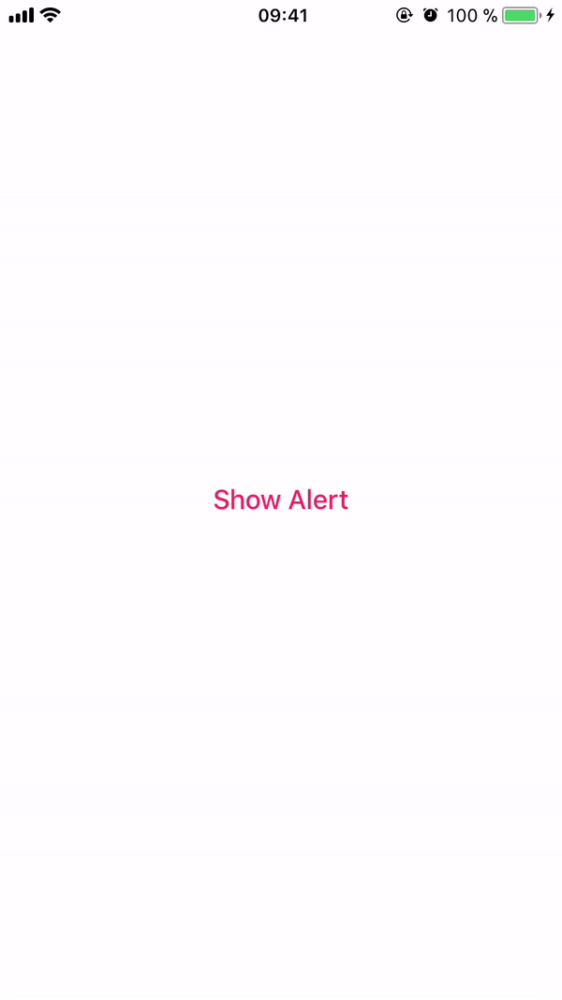

# LXStatusAlert


  

[![License][license-image]][license-url]

LXStatusAlert is a simple alert.




## Requirements

- Swift 4+
- iOS 9.0+
- Xcode 9+

## Installation

#### CocoaPods
You can use [CocoaPods](http://cocoapods.org/) to install `LXStatusAlert` by adding it to your `Podfile`:

```ruby
pod 'LXStatusAlert'
```

## Usage

Create a 'LXStatusAlert' instance with custom image, title and duration.


```swift
let statusAlert = LXStatusAlert(image: image, title: "Add to \"Favorites\"", duration: 0.2)

statusAlert.show()
```

## Donation

If you like my open source libraries, you can sponsor it! ☺️

[](https://www.paypal.me/leonx98)

## Author

Leon Hoppe, leonhoppe98@gmail.com

## License

Distributed under the MIT license. See ``LICENSE`` for more information.


[license-image]: https://img.shields.io/badge/License-MIT-green.svg
[license-url]: LICENSE

